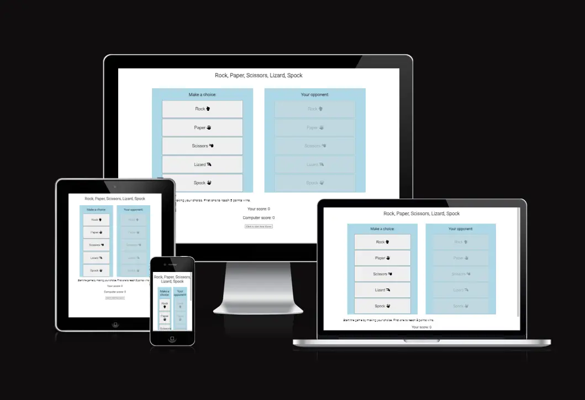
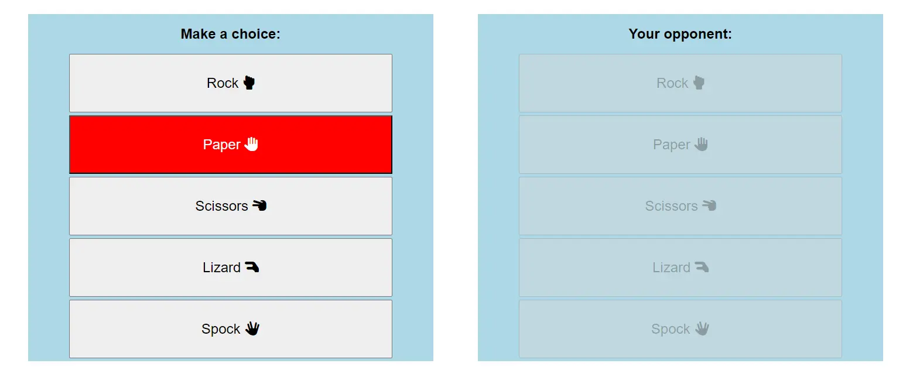
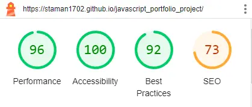

# ROCK, PAPER, SCISSORS, LIZARD, SPOCK

Rock, Paper, Scissors, Lizard, and Spock is a student-made website that lets you pass time and have some carefree fun playing the modern version of the good ol' classic Rock, Paper, Scissors. It's designed for single play only and declares a winner once one side gets 5 wins. The user is faced with 5 choices, while the computer's choice is random. At any point, the player can reset the score and start over.

## User Experience (UX)

### User stories

First Time Visitor Goals

- Introducing the player to an advanced level of Rock, Paper, Scissors.
- Providing simple and self-explanatory entertainment.
- Enjoying the game of chance against randomly generated choices.
- Ability to restart the game at any point.

Frequent User Goals

- Reliving the joy of the first visit.
- Getting more acquainted with the rules of the game.

## Features

### Header

- Featured at the top of the page, the header displays the name of the game.

### Game Area

- Player's playing area is on the left side, while the computer's area is on the right.
- Player's area consists of options to choose from: Rock, Paper, Scissors, Lizard, & Spock. These options are interactive buttons that change color when hovered over.
- To prevent player confusion, the computer's options are disabled buttons.
- Every time a choice is made, the button will stay colored; the same goes for the computer's choice.

### Result Area

- This section is composed of a message, the player's score count, the computer's score count, and the Play New Game button.
- Message instructs the player and displays the outcome of the last round played.
- Scores can only go up to 5.
- Play New Game button resets the scores to 0 and resets the visuals of the highlighted choice.
- Once the game finishes, the button changes its content and declares a winner.
  

## Testing

- I have confirmed that the project is responsive, looks good, and functions as intended on all standard screens.
- I have confirmed that all possible choices result in proper outcomes.
- I have confirmed that the hover action works.
- I have confirmed that all buttons work as intended.

### Validator Testing

- W3C HTML validator returns no errors.
- W3C CSS validator returns no errors.
- I used Lighthouse in retools.

## Deployment

- Site was deployed to GitHub pages
- The live link is available here - [ROCK PAPER SCISSORS LIZARD SPOCK](https://staman1702.github.io/javascript_portfolio_project/)

## Credits

- [Google Fonts:](https://fonts.google.com/) Font family "Roboto" was used on the page.
- [Font Awesome:](https://fontawesome.com/) Used in Game-area section to add icons.
- [Am I Responsive:](http://ami.responsivedesign.is) Was used to check responsiveness of page.
- [Free Convert:](https://www.freeconvert.com/) Converting PNG images to WEBP.
